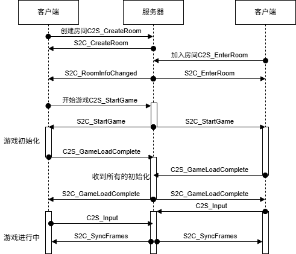

# README

该服务器是一个基于KCP实现的游戏帧同步服务器，同时提供了基本的房间管理功能。

它的特点是使用无锁结构`chan`实现并发操作间的数据同步，避免了死锁的bug

## 文件结构

- cmd：该文件夹包含main函数
- network：底层连接和服务器实现
- proto：kcp协议实现
- game：游戏帧同步服务器功能实现

## 代码解析

接下来我们根据文件逐个进行代码解析

### proto

proto文件夹包含两个协议文件
#### lockstep.proto
lockstep.proto：一个帧同步服务器的通用协议文件，它包含游戏内容无关的协议，运行过程如下图所示：



在上图中没有出现的HeartBeat报文，用于维持客户端连接，自始至终客户端都在按时发送，如果超时没有收到，那么就认为客户端断开了链接

在`C2S_Input`和`C2S_GameLoadComplete`等报文中有一段`bytes`数据。这是每个游戏根据自己的初始化需要定制的数据，在本项目中，请参照文件tetris.proto

#### tetris.proto
该文件包含初始化随机种子和记录每一次玩家操作数据结构

### network
network文件夹包含有关kcp网络连接的基本功能

conn.go文件包含了有关网络链接的结构`Conn`，我们采用一个协程`ReceiveLoop`来读取，然后发送给`handle`处理
```go
message := &pb.MessageWrapper{}
proto.Unmarshal(buf[:n], message)
c.handler.HandleChan() <- &ConnMessage{conn: c, msg: message}
```

`SendLoop`是用于发送数据的协程，它会等待`sendChan`中的数据并将其发送出去

svr.go文件包含了一个kcp服务器，它的基本功能是监听kcp端口并在有新的连接接入时，创建`conn`并运行，可以参照`Server`函数
```go
conn, err := lis.Accept()
if err == net.ErrClosed {
    break
} else if err != nil {
    log.Error("接受连接失败: %v", err)
    continue
}
NewConn(m, conn, m.handler).Start()
```

### game
game文件夹包含游戏过程中对kcp报文的处理

在服务器启动后，默认处理kcp报文的handle是一个`RoomManager`，它的报文处理函数为`handleMessage`

在接收到游戏开始的信号后，`RoomManager`会将链接的处理权限转交给`Game`，转交过程在`handleStartGame`中实现如下
```go
room := m.rooms[roomID]
handler := room.Game(m.ctx, m.cfg)
handler.Start()
for _, p := range room.Players() {
    p.Conn().SetHandler(handler)
    p.Conn().SendChan() <- reply
}
```

在game启动后，会等待客户端加载游戏，加载完毕后会启动计时器，在`tick`中会响应计时器并且计算帧，然后时刻同步双方客户端的用户操作数据，目前同步速度为1秒30帧。